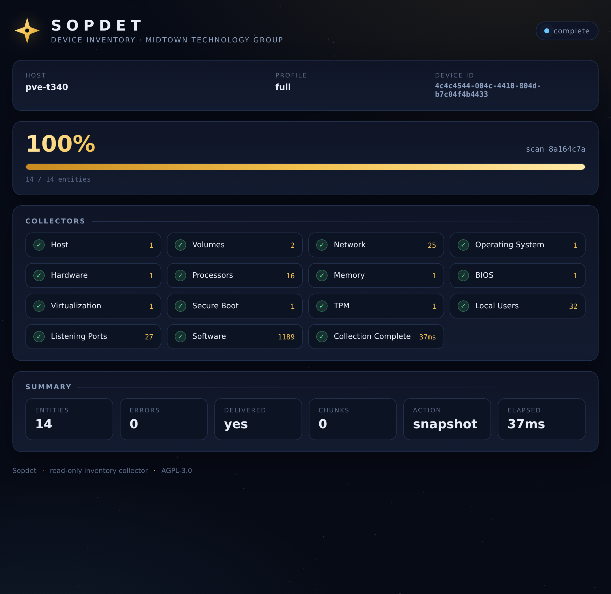

# Sopdet

Read-only device inventory for assessment and fleet reporting, in two
implementations that share one JSON contract:

- **Go agent** (this directory) — a single static binary for Windows, Linux, and
  macOS that collects a schema-validated envelope and delivers it to a Bifrost
  ingest endpoint (gzip + chunking + retry + durable spool) or to a local file.
- **PowerShell package** ([`powershell/`](powershell/README.md)) — a single-file,
  no-admin collector and prospect-ready assessment package (launcher, config,
  schema, consent template, signing/fan-out tooling). PSScriptAnalyzer clean.

Named for **Sopdet**, the Egyptian star whose heliacal rising was the observed
signal that timed the Nile flood — *read the signal, record the state.*

## Layout

```
cmd/sopdet/                 Go CLI entry point
internal/schema/            envelope types, canonical fingerprints, entity builder
internal/collect/           collector interface, gopsutil base collectors,
                            Windows WMI + registry, Linux dpkg
internal/state/             delta fingerprints (key -> hash)
internal/ingest/            gzip, entity-boundary chunking, retry/backoff, spool
internal/config/            config file
internal/app/               orchestration
schema/inventory.schema.json    the shared contract
testdata/                   schema-validation fixture (synthetic)
powershell/                 PowerShell assessment package
scripts/                    signing + publish tooling
Makefile, .github/workflows/ci.yml
```

## Build

```sh
make build      # bin/sopdet (host)
make cross      # windows/linux/darwin, amd64+arm64
make test       # unit + schema-validation tests
make vet
```

## Run (Go agent)

```sh
./bin/sopdet -profile minimal -dry-run -out device.json
./bin/sopdet -config inventory.config.json
./bin/sopdet -endpoint https://bifrost.example.com/api/endpoints/<id> \
    -api-key <key> -profile quick -compress -delta
```

Flags override the config file; a missing `inventory.config.json` next to the
binary is loaded automatically.

| Flag | Meaning |
|---|---|
| `-config` | config file path |
| `-profile` | `minimal` \| `quick` \| `full` |
| `-endpoint` / `-api-key` | Bifrost ingest endpoint and key |
| `-out` | write the envelope to a file |
| `-compress` | gzip+base64 the payload |
| `-delta` | send only changes after a baseline snapshot |
| `-dry-run` | collect only; never post |
| `-proxy`, `-state` | proxy URL, delta state file |
| `-include-appx`, `-include-processes` | extra entities |
| `-ui` | serve a local branded progress page for this run |
| `-ui-port` | fixed port for the page (default: random) |
| `-no-browser` | do not auto-open the page |
| `-quiet` | suppress the banner and per-entity progress |

### Progress and branding

Every run reports progress on the terminal: a branded banner, a live progress
meter, one line per collector, and a completion summary. When stdout is not a
terminal (or with `-quiet`) it degrades to plain log lines, so CI and captured
output stay readable.

`-ui` additionally serves a local web page with the same branding and a live
collector view:

```sh
./bin/sopdet -profile quick -ui -dry-run
```

The page is bound to `127.0.0.1` on a random port and gated behind a one-time
token in the URL; nothing is exposed off-host and no external runtime is
required (no WebView2). Progress streams over Server-Sent Events, and late
connections replay the run from the start, so opening the page after a scan
still shows the full result. The page stays up briefly after the run so the
summary can be read.



## Platform support

| Platform | Agent |
|---|---|
| Windows 10 / Server 2016+ | Go agent (cross-compiled) |
| Windows 7 SP1 / Server 2008 R2 – Server 2012 R2 | PowerShell package (PowerShell 3.0+, WMF 3+) |
| Linux | Go agent |
| macOS | Go agent |

The Go toolchain requires Windows 10/Server 2016+ (Go 1.21+ dropped older
Windows); the PowerShell package covers legacy endpoints down to PowerShell 3.0
and shares the same contract, so `device_inventory` remains uniform.

## Contract

One envelope per scan. Every entity record carries a stable `key`, a content
`fingerprint`, and `observed_at`. Sections that cannot be read are reported in
`entity_errors` (with `gated: true` for access-denied) rather than guessed. See
[`schema/inventory.schema.json`](schema/inventory.schema.json) and
[`WHAT-IT-COLLECTS.md`](WHAT-IT-COLLECTS.md).

Modes: `action=snapshot` (full), `action=delta` (added/changed/removed after a
baseline), per-entity transport chunks (`chunk`), and `-MaxPayloadBytes` size
budgeting with `summarized`/`omitted`.

**Fingerprint parity:** Go uses `sha256-canonical-json/v1` and is *not*
byte-identical to the PowerShell agent's canonicalization, so delta state is not
shared across implementations — run the first Go scan as a fresh baseline.

## Distribution tiers

| Tier | Signature | Audience |
|---|---|---|
| `publish-public` | unsigned **and** Public Trust | prospects / assessment |
| `publish-private` | Private Trust | managed fleet |

```sh
make sign-public      # Windows signing host -> dist/signed-public
make sign-private     # Windows signing host -> dist/signed-private
make publish-public   # stage dist/public
make publish-private  # stage dist/private
```

Provisioning: `bash scripts/artifact-signing-setup.sh` creates the Basic Artifact
Signing account and prints the identity-validation + certificate-profile steps;
fill `scripts/artifact-signing.env` (from `artifact-signing.env.example`).
Signing itself uses Azure Artifact Signing.
Every staged tier ships `MANIFEST.sha256`, the schema, and `WHAT-IT-COLLECTS.md`.
Note: running on a WDAC-enforced endpoint additionally requires a supplemental
App Control policy (or Managed Installer) that trusts the publisher — see
[docs/appcontrol.md](docs/appcontrol.md) and `scripts/New-AppControlPolicy.ps1`.

## License

AGPL-3.0. See [LICENSE](LICENSE).
